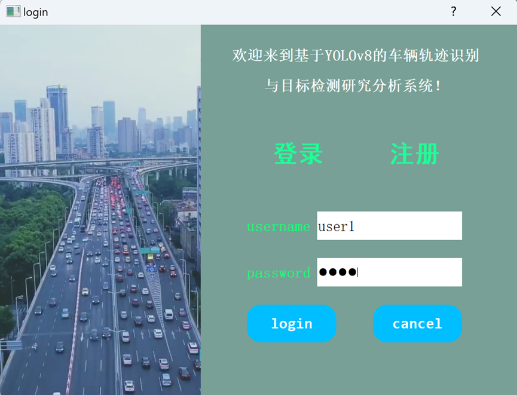
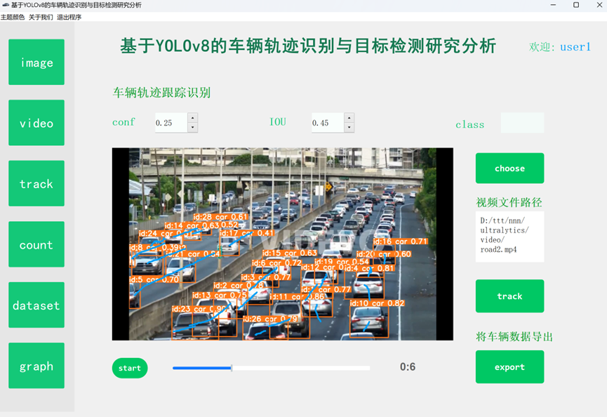
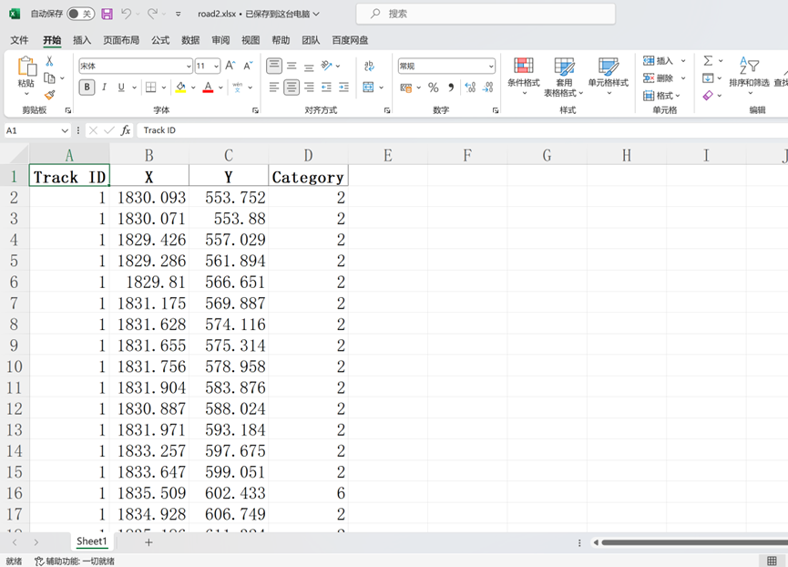
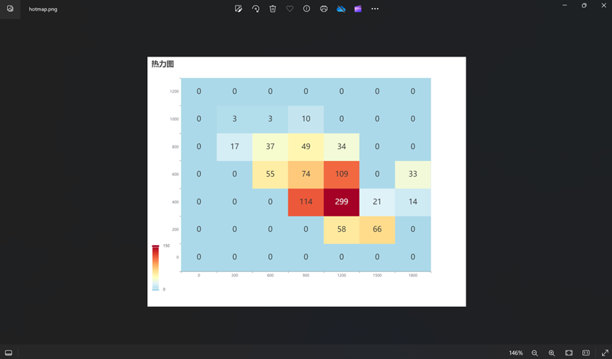
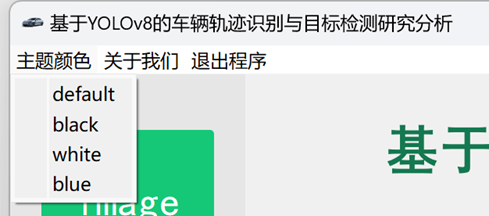
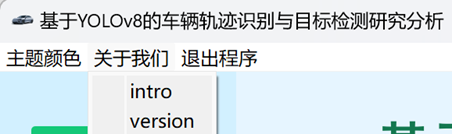
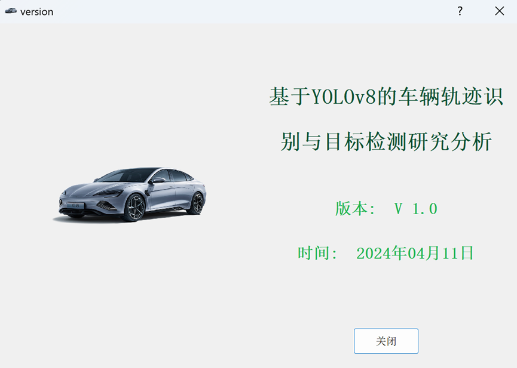

<div align="center">
  <h2>基于YOLOv8的车辆轨迹识别与目标检测研究分析软件</h2>
  <p>
    <a href="https://github.com/ultralytics/assets/releases/tag/v8.2.0" target="_blank">
      </a>
  </p>
</div>

YOLOv8 可以在 Python 环境中直接使用，简单示例如下：

```python
from ultralytics import YOLO

# 加载模型
model = YOLO("yolov8n.yaml")  # 从头开始构建新模型
model = YOLO("yolov8n.pt")  # 加载预训练模型（建议用于训练）

# 使用模型
model.train(data="coco128.yaml", epochs=3)  # 训练模型
metrics = model.val()  # 在验证集上评估模型性能
results = model("https://ultralytics.com/images/bus.jpg")  # 对图像进行预测
success = model.export(format="onnx")  # 将模型导出为 ONNX 格式
```

查看 YOLOv8 [Python 文档](https://docs.ultralytics.com/usage/python) 以获取更多示例。

## <div align="center"> ⭐ 项目功能 </div>

### 交通物体检测与实例分割 
本项目基于YOLOv8框架，能够对交通物体进行检测。对图片能检测到物体并用锚框进行标注展示，对于视频则是对每一帧进行物体检测分析，同样使用锚框进行标注，最终生成的物体检测视频能实时追踪物体并用不同颜色框进行标注展示。

用户除了选择常规的模型进行物体检测之外，还可以使用专门进行实例分割的模型。在训练预测之后，可以得到不同的物体。与单纯的物体检测有些不同，实例分割能够对物体的轮廓进行较为精细的标注，并将整个物体以特定的颜色进行标注，相比于普通的物体检测能够产生更精细且更好的可视化效果。

### 交通轨迹识别
本项目能够对导入的交通视频进行物体检测，通过物体的id标注，视频的逐帧分析，捕捉每个物体对应的实时位置，同时绘制位置点到视频中，最后整合能够生成带有绘制物体轨迹的视频，实现交通车辆的轨迹识别。

### 车辆越线计数
在进行车辆跟踪，轨迹绘制的基础上，本软件还能对车辆进行越线计数。在视频的关键处，可以绘制分界线，当车辆越过该线时，通过逐帧捕捉车辆坐标信息，对应id后能够进行车辆计数值的自增，实现越线计数的功能。

### 生成交通数据集
在物体轨迹识别的过程，捕捉位置坐标并绘制轨迹时，将不同车辆的位置信息分别记录起来，同时记录车辆id、类别等信息。在视频检测完毕后，对数据进行汇总并做相关处理，能够生成较为理想的交通数据集。 

### 交通数据分析
将生成的交通数据集进行导入，能够进行关键数据的具体分析，包括不同类别物体的检测计数，车辆位置信息等。通过热力图，柱状图等方式直观呈现数据，利于清楚看出数据的各项分布情况。


## <div align="center"> ⭐ 项目部署 </div>

在Pycharm中打开该项目，配置一个venv虚拟环境后，直接按下面命令安装依赖即可：
```bash
pip install -r requirements.txt
```


## <div align="center"> ⭐ 注意事项 </div>

- main.py为本项目程序入口文件，软件的所有功能都写在这个文件中，前端页面设计在 `ui` 目录下
- 本程序中连接了数据库，需要自己配置与本地的数据库进行连接，如不需要数据库的话，只需使用 `main_without_login.py` 就行
- 或者把main.py的180行位置下的以下代码注释掉并调整缩进也可以：
```python
# 显示登录对话框
login_dialog = LoginDialog()
result = login_dialog.exec_()
# 检查登录对话框返回结果
if result == QDialog.Accepted:
# 下文记得向前缩进
```


## <div align="center"> ⭐ 具体使用说明 </div>

### 登录注册
打开本软件，用户首先需要进行登录注册。首次使用时， 一开始需要先注册一个账号，并在登录页输入账号密码进行登录。

本软件采用mysql数据库对用户的信息进行存储管理。其中有一些基本的校验，用于判断账号是否存在，注册使用的用户名是否与他人重复，以及每个账号对应的密码是否匹配等等。只有注册成功，并在登录页中输入正确的账号密码，用户才能成功登录此软件。以下是相关软件页面展示：
 

<div align="center">（登录注册页面）</div>


<div align="center">（合法校验后的相应提示）</div>
 

<div align="center">（mysql后台数据存储显示）</div>

### 首页
用户登录成功后，按下提示框中的ok键，便会直接跳转到本软件并呈现首页（侧边栏的第一项）：image图片物体检测。在该页面中的右上方会显示当前登录用户的账号名。具体布局如下图所示： 
 

<div align="center">（软件布局介绍）</div>

### 侧边栏
侧边栏用于实现导航栏的功能，总共有6个选项卡，除了第一个image栏带有图片检测的功能之外，点击其他5个选项会分别跳转到不同的子页面，对应着视频物体检测、轨迹识别、越线计数等功能。

### 图片物体检测
用户可以点击左下角的select按钮，会弹出一个文件管理器，用户通过选择对应路径下的图片进行导入，导入成功后会在左侧显示导入图片，之后点击右下角的show按钮，将开始对选择的图片进行物体检测。模型训练完检测成功后，右边的框中会显示处理好后的图片。其中对每个物体根据不同类别进行了不同颜色的锚框标注，每个物体上面会显示检测的置信度，值越高代表对物体的预测正确的把握值越高。

在此页面上部分，可以选择检测模型，默认的模型能够对物体进行检测并用矩形锚框标注出来。此外还可以选择实例分割模型，能够根据不同物体的轮廓进行具体分割，并对每个物体进行相应的颜色填充标注。除了模型选择，用户还可以对置信度conf，IOU进行参数调整，同时还可以指定要检测的class类别，不指定的话默认会检测出所有类别的物体。其中，指定的conf越小，即识别的精确度要求降低，模型大概率会识别出更多的物体。

以下是相关软件界面展示：
 

<div align="center">（弹出文件管理器选择图片）</div>
 

<div align="center">（默认物体识别）</div>
 

<div align="center">（调参并指定具体类别的物体识别）</div>
 

<div align="center">（物体实例分割）</div>

### 视频物体检测
点击侧边栏的第二个选项卡video，便能跳转到第二个页面，对视频进行物体检测分析。类似的，用户可以点击左下角的select按钮，在弹出的窗口中进行视频文件选择，选择好后要，左侧框会自动对视频进行播放。当用户点击右下角的show按钮后，模型开始训练，对视频的每一帧画面进行物体检测，同时进行相关锚框和置信度的标注，最终整合成处理好的视频，在右侧框中进行播放展示。效果如下：
 

<div align="center">（默认物体检测效果）</div>

同样地，在界面上侧还能对训练进行调参处理，可以选择预训练模型，设置置信度，IOU值和指定要检测的分类。当选择实例分割模型时，与图片类似，会将视频的每一帧都进行实例分割，最终呈现的视频中，每个物体都会根据检测出的类别以及其轮廓，被标注填充为不同的颜色。当设置的置信度越低时，所识别出的物体数和种类数可能相对变多。也可以通过设置class类别，对某一种具体物体进行检测，调参后具体效果如下：
 

<div align="center">（调参后检测效果）</div>
 

<div align="center">（物体实例分割效果）</div>

### 车辆轨迹识别与绘制
当用户选择track侧边栏后，能够跳转到车辆轨迹识别页面。导入相应视频后，用户点击track即可快速对该视频进行物体检测与车辆轨迹识别，默认情况下，模型会检测所有物体并对所有物体进行跟踪检测和轨迹绘制，用户可以指定类别class来筛选出需要进行轨迹识别与绘制的具体物体类别。另外，本功能也支持用户对置信度conf，IOU参数进行调整，效果如下图：
 


### 车辆越线检测与计数
用户点击左侧的count选项卡能进行到该子页面。与上个功能类似，该子页面中选择视频、点击count按钮后，也能对交通物体进行轨迹识别与绘制。不过在此基础上，本软件在视频中增加了分界线，在逐帧跟踪检测物体的同时会不断根据车辆的坐标来进行物体的越线判断，一旦检测到车辆越线，便能对count进行自增从而实现车辆物体的计数功能。具体展示效果如下：
 

<div align="center">（车辆越线检测展示）</div>

### 生成交通数据集
在之前的车辆轨迹识别、越线检测计数功能中，模型需要不断收集物体的位置坐标等信息来进行相应的逻辑判断，在该过程中，通过对不同id的物体的位置，类别等数据进行收集归纳整理，当用户点击export导出时，本软件能够对收集到的处理好的信息进行整合，并生成对应的xlsx或者csv格式的数据集。

效果如下：
 

<div align="center">（生成数据集导出）</div>
 

<div align="center">（查看导出数据集）</div>

### 数据集导入与分析
用户点击dataset选项卡之后，点击子页面中的select按钮，能够对之前生成的数据集进行导入，展示数据集时还会显示整个数据集的行列数，效果如下：
 

<div align="center">（数据集选择）</div>
 

<div align="center">（数据集展示）</div>
导入数据集后，用户在页面右侧可以指定具体的物体id，点击后在下方即可显示物体的类别以及物体在视频不同时刻中对应的位置信息分布图，效果如下：
 

<div align="center">（物体相关信息）</div>

### 数据图表可视化
用户点击第六个侧边栏选项graph后，在对应的子页面中将显示之前所选数据集的位置热力图分布，以及不同类别的物体检测数量柱状图。此外，在右下角还会对关键的数据信息进行展示，直观呈现数据集的某些关键点。效果展示如下：
 


### 图表导出为图片
在每个图表的周围，都有一个save按钮，可以将对应的图像进行重命名并保存导出为图片，利于用户存储记录一些包含关键数据的图表，效果展示如下：
 

<div align="center">（命名并保存为图片）</div>
 

<div align="center">（成功导出图片展示）</div>

### 软件主题色
在软件最左上角的区域是菜单栏，用户可以选择主题。主题的下拉菜单里有4种软件主题色调供用户选择，点击不同按钮即可切换不同主题色。
 


以下是不同主题色的展示效果图：
  

<div align="center">（默认色调）</div>
 

<div align="center">（暗黑色调）</div>
 

<div align="center">（纯白色调）</div>
 

<div align="center">（天蓝色调）</div>

### 软件简介与版本
菜单栏里，“关于我们”按钮的下拉框中，可选intro来查看本软件的简要介绍，也可选择version来查看软件当前版本相关信息。



效果如下：

 
<div align="center">（introduction软件介绍）</div>
 

<div align="center">（version版本信息）</div>

### 退出程序
点击菜单栏中的退出，在弹出的下拉框中点击exit，或者点击页面右上角的×按钮，均可退出本程序。


